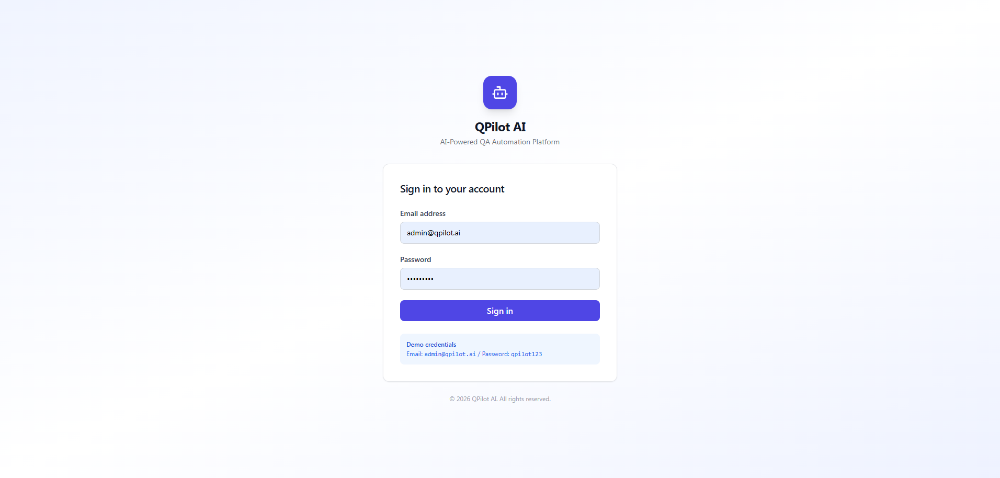
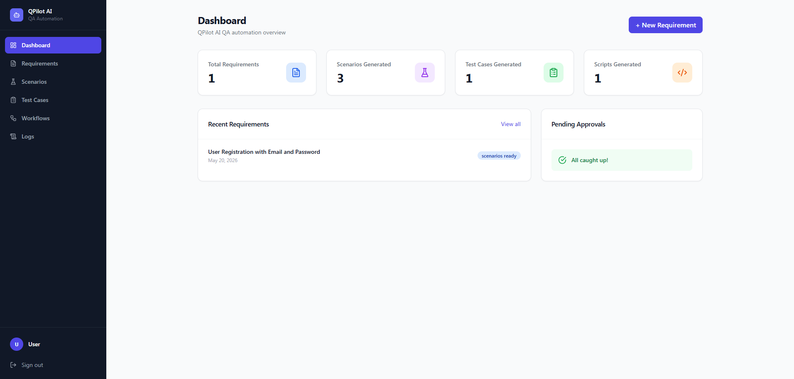
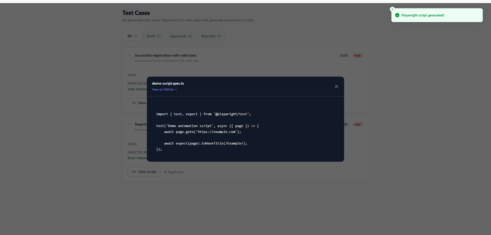
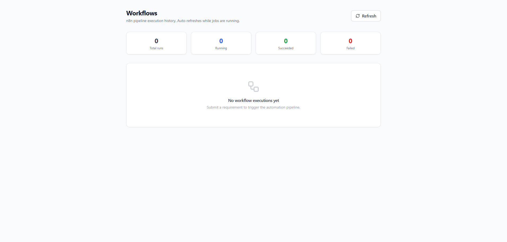
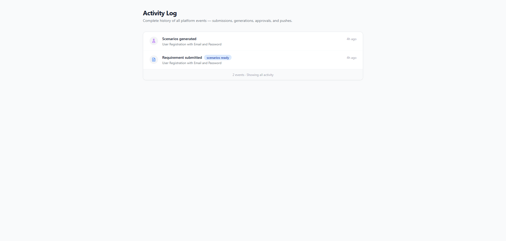

# QPilot AI

AI-Powered QA Automation Platform built with FastAPI, Next.js, Playwright, and LLM integrations.

QPilot AI transforms software requirements into intelligent QA assets including:
- Test Scenarios
- Test Cases
- Playwright Automation Scripts
- Approval Workflows

The platform leverages AI to accelerate the software testing lifecycle and reduce manual QA effort.

---
# Screenshots

## Login Page



---

## Dashboard



---

## Requirements Page


---

## Create New Requirement


---

## AI Scenario Generation


---

## Test Cases Page


---

## generate automation scripts Page



---

## Workflow View



---

## Logs Monitoring



---


# Why I Built This Project

As a QA Engineer interested in AI-powered testing and automation, I wanted to build a platform that reduces the manual effort involved in the traditional QA lifecycle.

Most QA workflows still rely heavily on manual requirement analysis, scenario design, and test case writing. I wanted to explore how Large Language Models (LLMs) could accelerate and improve this process.

QPilot AI was built as an experimental MVP to combine:
- AI-powered QA workflows
- Modern web technologies
- Automation engineering
- Scalable backend architecture

The goal was to create an intelligent QA assistant capable of transforming requirements into executable automation assets.
---

---

# Key Features

## Authentication System

* JWT Authentication
* Secure login system
* Protected API routes
* Session persistence

## Requirement Management

* Create and manage software requirements
* Store requirement metadata
* Requirement status tracking

## AI Scenario Generation

Generate intelligent test scenarios directly from business requirements.

Supported scenario types:

* Positive scenarios
* Negative scenarios
* Edge cases

## AI Test Case Generation

Generate structured test cases from scenarios.

Includes:

* Preconditions
* Test steps
* Expected results
* Priorities

## AI Automation Script Generation

Generate Playwright automation scripts automatically.

Generated scripts include:

* Assertions
* Dynamic test data
* Page interactions
* Validation logic

## Approval Workflow

* Approve generated test assets
* Reject or regenerate content
* QA review workflow

## Integrations

### GitHub Integration

* Push generated automation scripts to repositories

### Slack Integration

* Send notifications when automation scripts are generated

---

# Tech Stack

## Backend

* FastAPI
* SQLAlchemy
* AsyncIO
* Pydantic
* JWT Authentication
* SQLite / PostgreSQL

## Frontend

* Next.js 14
* TypeScript
* Tailwind CSS
* Zustand
* React Hook Form
* Zod
* Axios

## AI & Automation

* OpenRouter API
* LLM-based generation
* Playwright

---

# System Architecture

```text
Frontend (Next.js)
        ↓
FastAPI Backend
        ↓
AI Services Layer
        ↓
OpenRouter / LLM Models
        ↓
Generated QA Assets
```

---

# AI Workflow

## 1. Submit Requirement

The user submits a software requirement.

Example:

```text
Users should be able to register using email and password.
```

## 2. Generate Scenarios

The AI generates multiple testing scenarios.

Example:

* Successful registration
* Duplicate email registration
* Invalid password format
* Empty fields validation

## 3. Generate Test Cases

Structured test cases are generated for each scenario.

## 4. Generate Automation Script

The platform generates a Playwright automation script automatically.

---

# Example Generated Automation Script

```ts
import { test, expect } from '@playwright/test';

test('Successful registration', async ({ page }) => {
  await page.goto('/register');

  await page.fill('[data-testid="email"]', 'test@example.com');
  await page.fill('[data-testid="password"]', 'Test@123');

  await page.click('[data-testid="register-button"]');

  await expect(page).toHaveURL('/dashboard');
});
```

---

# Project Structure

```text
qpilot/
│
├── backend/
│   ├── app/
│   │   ├── api/
│   │   ├── services/
│   │   ├── models/
│   │   ├── schemas/
│   │   ├── db/
│   │   └── core/
│   └── requirements.txt
│
├── frontend/
│   ├── src/
│   │   ├── app/
│   │   ├── components/
│   │   ├── services/
│   │   ├── store/
│   │   └── lib/
│   └── package.json
│
└── README.md
```

---

# API Endpoints

## Authentication

* `POST /api/v1/auth/register`
* `POST /api/v1/auth/login`
* `GET /api/v1/auth/profile`

## Requirements

* `POST /api/v1/requirements`
* `GET /api/v1/requirements`

## Scenarios

* `POST /api/v1/scenarios/generate`
* `GET /api/v1/scenarios/{requirement_id}`

## Test Cases

* `POST /api/v1/test-cases/generate`
* `GET /api/v1/test-cases/{scenario_id}`

## Automation

* `POST /api/v1/automation/generate`
* `GET /api/v1/automation/{script_id}`

---

# Installation & Setup

## Backend Setup

```bash
cd backend

python -m venv venv

venv\Scripts\activate

pip install -r requirements.txt

python -m uvicorn app.main:app --reload
```

Backend runs on:

```text
http://localhost:8000
```

---

## Frontend Setup

```bash
cd frontend

npm install

npm run dev
```

Frontend runs on:

```text
http://localhost:3000
```

---

# Environment Variables

Create a `.env` file inside the backend directory.

Example:

```env
OPENAI_API_KEY=your_api_key
OPENAI_BASE_URL=https://openrouter.ai/api/v1
OPENAI_MODEL=deepseek/deepseek-v4-flash:free
DATABASE_URL=sqlite+aiosqlite:///./qpilot.db
JWT_SECRET=your_secret
```

---

# Challenges Faced

During development, several real engineering challenges were encountered and solved:

- Handling invalid AI-generated JSON responses
- Retry handling for AI rate limits and API failures
- Managing async database operations with SQLAlchemy
- Designing scalable FastAPI architecture
- Frontend/backend integration challenges
- JWT authentication and protected routes
- Handling GitHub push protection and secret scanning
- Managing large file cleanup from Git history
- Structuring AI prompts for reliable outputs
- Building stable AI generation pipelines

---

# What I Learned

Building QPilot AI helped me gain hands-on experience with:

- AI integration workflows
- Prompt engineering techniques
- FastAPI backend architecture
- Async Python development
- Authentication systems with JWT
- React + Next.js frontend development
- State management with Zustand
- API integration and error handling
- Playwright automation generation
- Git and repository management
- Debugging real-world integration issues

This project significantly improved my understanding of how AI systems can be integrated into modern software engineering workflows.
---


# Architecture Diagram

```text
                ┌──────────────────────┐
                │     Next.js Frontend │
                └──────────┬───────────┘
                           │ REST API
                           ▼
                ┌──────────────────────┐
                │    FastAPI Backend   │
                └──────────┬───────────┘
                           │
          ┌────────────────┼────────────────┐
          ▼                ▼                ▼
 ┌────────────────┐ ┌───────────────┐ ┌──────────────┐
 │  AI Service    │ │ Authentication│ │ Database     │
 │ OpenRouter LLM │ │ JWT Security  │ │ SQLite/Postg │
 └────────────────┘ └───────────────┘ └──────────────┘
                           │
                           ▼
                ┌──────────────────────┐
                │ Generated QA Assets  │
                │ Scenarios/Test Cases │
                │ Automation Scripts   │
                └──────────────────────┘
```


# Author

Mohamed Sobhy

Computer Science Graduate | QA Engineer | AI-Powered Testing Enthusiast

GitHub:
[https://github.com/mohamedsobhy77](https://github.com/mohamedsobhy77)

LinkedIn:
[https://www.linkedin.com/in/mohamed-sobhy](https://www.linkedin.com/in/mohamed-sobhy)

---

# License

This project is licensed under the MIT License.
